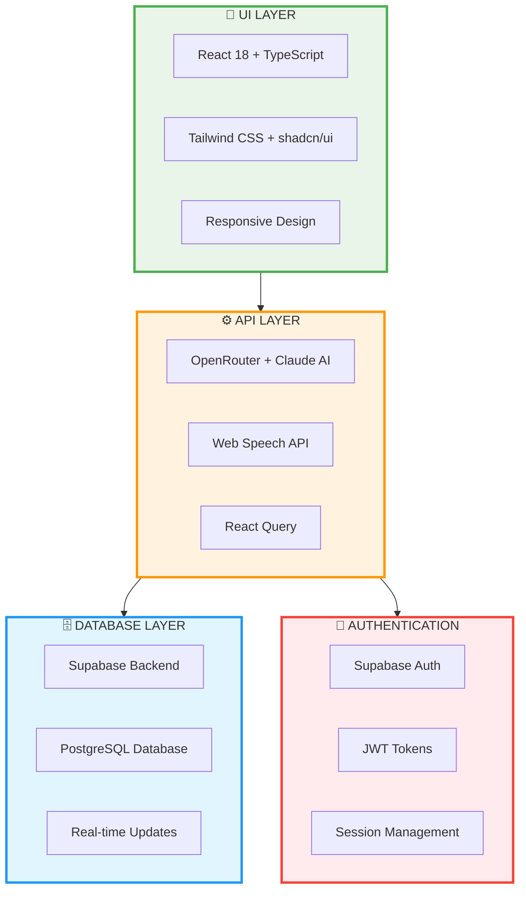
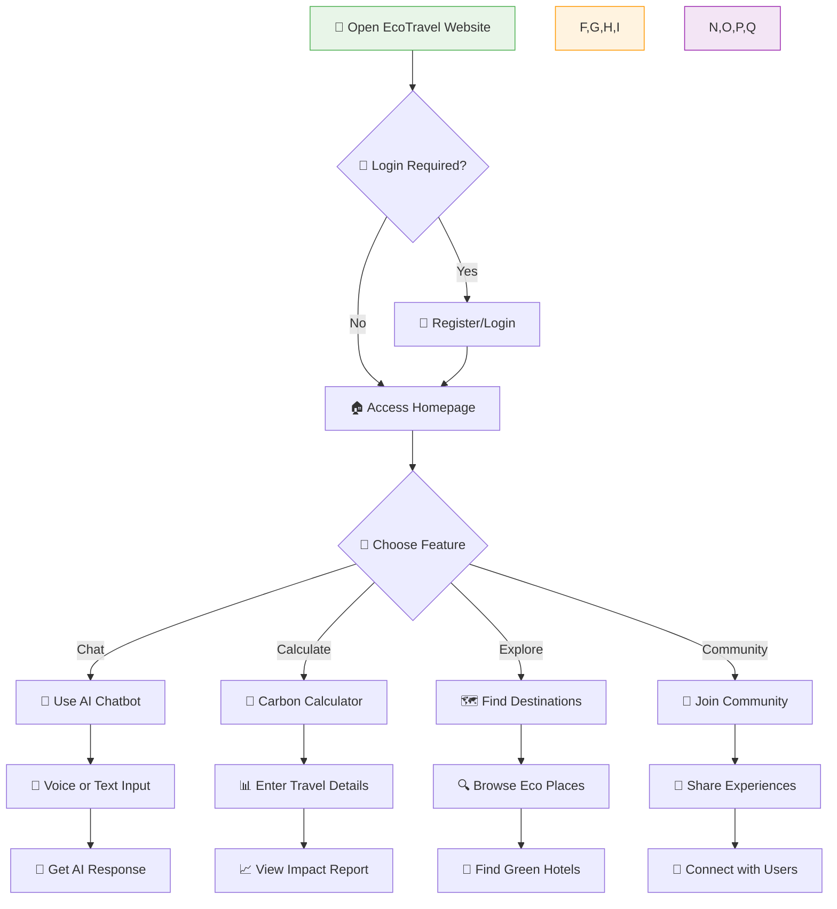
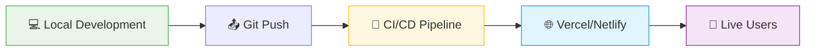

# EcoTravel - Sustainable Tourism Platform
## Simple Block Diagram for College Presentation

---

## 🛠️ **Technology Stack**

---

## 📊 **Input & Output Flow**

```mermaid
flowchart LR
    subgraph INPUT ["📥 USER INPUT"]
        I1[🎤 Voice Commands]
        I2[💬 Text Messages]
        I3[📊 Travel Data]
        I4[🔐 Login Info]
    end
    
    subgraph PROCESSING ["⚙️ PROCESSING"]
        P1[🧠 AI Processing]
        P2[🧮 Carbon Calculation]
        P3[🔍 Data Analysis]
    end
    
    subgraph OUTPUT ["📤 USER OUTPUT"]
        O1[💬 AI Responses]
        O2[📊 Impact Reports]
        O3[🗺️ Eco Destinations]
        O4[📈 Analytics Charts]
    end
    
    INPUT --> PROCESSING
    PROCESSING --> OUTPUT
    
    style INPUT fill:#E8F5E8,stroke:#4CAF50
    style PROCESSING fill:#FFF8E1,stroke:#FFC107
    style OUTPUT fill:#F3E5F5,stroke:#9C27B0
```

---

## 🎯 **How to Use EcoTravel**

---

## 📋 **Technical Specifications**

### **Frontend Technologies**
| Component | Technology | Purpose |
|-----------|------------|---------|
| **Framework** | React 18 + TypeScript | Modern UI development |
| **Styling** | Tailwind CSS + shadcn/ui | Responsive design system |
| **Build Tool** | Vite | Fast development builds |
| **State** | React Query | API state management |
| **Routing** | React Router | Single page navigation |

### **Backend & APIs**
| Component | Technology | Purpose |
|-----------|------------|---------|
| **AI Service** | OpenRouter + Claude Sonnet | Natural language processing |
| **Database** | Supabase + PostgreSQL | Data storage & real-time sync |
| **Authentication** | Supabase Auth | User login & security |
| **Voice** | Web Speech API | Speech recognition/synthesis |
| **Charts** | Chart.js | Data visualization |

### **Key Features**
- 🤖 **AI Chatbot** - Voice & text interaction
- 🧮 **Carbon Calculator** - Travel impact assessment  
- 🗺️ **Destinations** - Eco-friendly travel spots
- 👥 **Community** - User experience sharing
- 📱 **Responsive** - Works on all devices
- 🔐 **Secure** - Protected user data

### **Performance Specs**
- ⚡ **Load Time** - Under 3 seconds
- 📱 **Mobile First** - Optimized for mobile devices  
- 🌐 **Cross Browser** - Chrome, Firefox, Safari, Edge
- 📶 **Offline Support** - Basic functionality without internet
- 🔄 **Real-time** - Live data updates via Supabase

---

## 🚀 **Deployment & Hosting**

**Hosting Platform**: Vercel or Netlify  
**Domain**: Custom domain with HTTPS  
**CDN**: Global content delivery network  
**Monitoring**: Real-time performance tracking